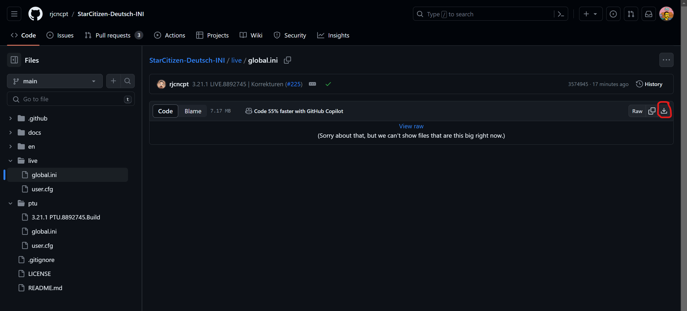

= Dokumentation der deutschen Lokalisierung für Star Citizen
v0.0.1, 13.11.2023
// Nachfolgende Zeilen dienen der Formartierung des PDF.
:doctype: book
:sectnums:
:partnums:
:part-signifier: Teil
:chapter-signifier: Kapitel
:chapter-refsig: Kapitel
:table-caption: Tabelle
:figure-caption: Abbildung
:toc-title: Inhaltsverzeichnis
:toc:

Dieses Dokument stellt die gesammelte Dokumentation zur Community-getriebenen Übersetzung des Spiels https://robertsspaceindustries.com/[Star Citizen] ins Deutsche dar.

== Dokumentation für Nutzende

=== Installation

==== Release-Download
Täglich gegen 04:00 Uhr Nachts wird aus den Änderungen des Vortags automatisch ein LIVE-Release erstellt. Lade dir *https://github.com/rjcncpt/StarCitizen-Deutsch-INI/releases[die neuste ZIP Datei herunter]* und entpacke diese im LIVE Ordner. Wenn du die INI-Datei des LIVE-Channel im PTU-Channel nutzt, kann es zu Darstellungsfehlern kommen.

In der ZIP-Datei befinden sich die Dateien *`global.ini`* und *`user.cfg`*. Wenn du nicht möchtest das die *`user.cfg`* Datei deine eigene überschreibt, lade die *`global.ini`* einzeln als <<Direktdownload>>.

===== Schritte
1. Lade dir die Datei **`https://github.com/rjcncpt/StarCitizen-Deutsch-INI/releases[StarCitizen.Deutsch.zip]`** herunter
2. Entpacke diese an einem beliebigen Ort
3. Kopiere den entpackten Inhalt in den LIVE (oder ggf. PTU) Ordner im Star Citizen Verzeichnis

#Hinweis: Der Standardpfad zum Star Citizen Verzeichnis lautet **C:\Program Files\Roberts Space Industries\Star Citizen**. In einem auf Deutsch eignestellten Windows wird dieser Pfad als **C:\Programme\Roberts Space Industries\Star Citizen** dargestellt. Solltest du bei der Installation von Star Citizen einen anderen Pfad angegeben haben, kannst du diesen im RSI Launcher unter Settings finden.#

==== Direktdownload
Du kannst die `global.ini` auch direkt aus dem Verzeichnis herunterladen, wenn du nicht immer die komplette ZIP-Datei herunterladen möchtest. Der Vorteil hierbei ist, dass sich diese Datei immer auf dem aktuellsten Stand befindet. Die `global.ini` für den LIVE-Channel findest du im **`https://github.com/rjcncpt/StarCitizen-Deutsch-INI/tree/main/live[live]`** Ordner des Repositories. Die `global.ini` für den PTU-Channel liegt analog dazu im **`https://github.com/rjcncpt/StarCitizen-Deutsch-INI/tree/main/ptu[ptu]`** Ordner.

.Direktdownload der global.ini

===== Installation
1. *https://github.com/rjcncpt/StarCitizen-Deutsch-INI/blob/main/live/global.ini[Klicke hier]* und öffne die `global.ini` Datei
2. Klicke im neuen Fenster auf den Downloadbutton oben rechts (Im Screenshot rot markiert).
3. Erstelle folgende Ordner im Star Citizen Verzeichnis und füge die `global.ini`-Datei in den Ordner `german_(Germany)` ein. Der Ordnerpfad muss wie folgt aussehen:
+
**\StarCitizen\LIVE\data\Localization\german_(germany)\**
+
4. speichere ggf. die `user.cfg` in den LIVE Ordner:
+
**\StarCitizen\LIVE\**
+

#Hinweis: Der Standardpfad zum Star Citizen Verzeichnis lautet **C:\Program Files\Roberts Space Industries\Star Citizen**. In einem auf Deutsch eignestellten Windows wird dieser Pfad als **C:\Programme\Roberts Space Industries\Star Citizen** dargestellt. Solltest du bei der Installation von Star Citizen einen anderen Pfad angegeben haben, kannst du diesen im RSI Launcher unter Settings finden.#

=== Ansätze zur Problemlösung

==== Fehler: Es werden kryptische Variablen mit @-Zeichen am Anfang angezeigt
Unsere **`global.ini`** Datei liegt bereits im korrekten **`UTF-8-BOM`** Format vor. Wenn bei dir Variablen angezeigt werden, die mit einem @-Zeichen beginnen, aber die Ordnerstuktur richtig ist und du im richtigen Channel bist, scheint die Codierung der Datei falsch zu sein. Lade entweder **[die aktuelle Datei erneut herunter](https://github.com/rjcncpt/StarCitizen-Deutsch-INI/blob/main/live/global.ini)** oder stelle die Codierung deiner Datei manuell um:

1. Öffne die **`global.ini`** in einem Texteditor wie Notepad++
2. Klicke anschließend in der Symbolleiste auf "Codierung"
3. Wähle **`UTF-8-BOM`**
4. Speichere die Datei

==== Ich habe alles richtig gemacht, aber es werden immer noch englische Texte angezeigt
Achte bei den beiden Dateien **`global.ini`** und **`user.cfg`** auf die richtigen Dateiendungen.

Kontrolliere ob es die richtige Dateiendung ist:

1. Öffne den Windows Dateiexplorer
2. Klicke auf Ansicht am oberen Fensterrand
3. Aktiviere im Bereich Ein-/ausblenden: **`Dateinamenerweiterungen`**
4. Sollten die beiden Dateien nun **`global.ini.ini`** oder **`user.txt.cfg`** oder ähnlich heißen, musst du sie zurück in **`global.ini`** und **`user.cfg`** umbennenen.

==== Fehler: Keine englische Sprachausgabe im Spiel
Es gibt einen Fix für das Audio Problem. Du musst deiner **`user.cfg`** Datei die folgende Zeile hinzufügen:
**`g_languageAudio = english`**

Alternativ lade dir unsere **`https://github.com/rjcncpt/StarCitizen-Deutsch-INI/blob/main/live/user.cfg[user.cfg]`** Datei herunter, in der wir das bereits für dich übernommen haben.

== Dokumentation für Mitwirkende

=== GitHub Workflow
Platzhalter

=== Vorgang zum Erhalt der korrigierten englischen `global.ini`
Hier wird der Vorgang zum Export und der Korrektur der englsichen global.ini aus Star Citizen dargestellt.

==== Vorbedingungen
Folgende Software muss lokal auf deinem Rechner vorhanden/installiert sein.

    * https://github.com/dolkensp/unp4k[unp4k]
    * Das Script https://github.com/rjcncpt/StarCitizen-Deutsch-INI/blob/main/scripts/prepare_cig_ini.py[`prepare_cig_ini.py`] und die Batch-Datei https://github.com/rjcncpt/StarCitizen-Deutsch-INI/blob/main/scripts/start.bat[`start.bat`] aus dem Ordner scripts.
    * https://www.python.org/[Python]
    * Star Citizen

==== Entpacken und Korrigieren der global.in
1. In der Batch-Datei start.bat muss der Pfad zur `python.exe` angepasst werden. Dieser muss gem. der Python Installation auf deinem Rechner konfiguriert sein.
2. Im Script `prepare_cig_ini.py` müssen die Pfade zu unp4k und zur Data.p4k angepasst werden.
    * Von Haus aus ist das Script so konfiguriert, dass es die `unp4k.exe` im Unterordner unp4k des eigenen Verzeichnisses erwartet.
    * Als Pfad zur `Data.p4k` ist der Standard-Installations-Pfad von Star Citizen vorkonfiguriert.
3. Führe das Script durch einen Doppelklick auf die `start.bat` Datei aus.
4. Im Ordner, in dem auch das Python Skript liegt wird die korrigierte `global.ini` gespeichert.
